<div align="center">



</div>

---

<div align="center"><sub>— TABLE OF CONTENTS —</sub></div>

&nbsp;[Overview](#overview) &nbsp;·&nbsp; [What Was Built](#what-was-built) &nbsp;·&nbsp; [Architecture](#architecture) &nbsp;·&nbsp; [Project Structure](#project-structure) &nbsp;·&nbsp; [Build & Run](#build--run) &nbsp;·&nbsp; [Controls](#controls) &nbsp;·&nbsp; [Team](#team)

---

## Overview

**Centipede** is a vertically-oriented fixed-shooter arcade game — a full reimplementation of the 1981 Atari original, built from scratch in **C++ with SFML** for **CS1002: Programming Fundamentals (Fall 2023)** at **FAST NUCES Islamabad**.

No game engine. No physics library. The entire game lives in a single source file. The 30×30 grid is a 2D array. Every entity — centipede segments, bullets, mushrooms, and bonus enemies — is tracked with raw coordinate arrays updated per frame inside a manually managed game loop.

---

## What Was Built

### Core Gameplay

- **30×30 grid** — `gameGrid[gameRows][gameColumns]`, `32×32px` cells, rendered at `960×960` windowed to `640×640`
- **12-segment centipede** — `int cp[12][3]` storing `x`, `y`, `exists` per segment
- Centipede spawns at a random column, moves horizontally, **descends one row and reverses** on hitting a wall or mushroom
- **Segment splitting** — a laser hitting mid-body splits the chain into two independent pieces; the rear piece grows its own head and continues down
- **Player zone** — 3 rows tall (`playerarea = 3`), full screen width; movement restricted to this zone via arrow keys
- **Single active bullet** — one laser at a time, white pixel, travels upward each frame
- **Mushroom field** — 20–30 mushrooms randomly placed; each takes **2 shots** to destroy; more mushrooms = centipede descends faster
- Centipede reaching the player zone costs a life

### Bonus Enemies

| Enemy | Behaviour |
|-------|-----------|
| **Spider** | Zig-zag across the player zone, eats mushrooms |
| **Scorpion** | Horizontal pass — poisons every mushroom it touches (turns them white) |
| **Flea** | Drops vertically when fewer than 3 mushrooms remain in player zone; leaves a trail of mushrooms |

### Audio & Polish

- **9 WAV sound effects** via SFML Audio: `fire1.wav`, `kill.wav`, `death.wav`, `1up.wav`, `bonus.wav`, `newBeat.wav`, `flea.wav`, `scorpion.wav`, `spider.wav`
- **Background music** — `Music/field_of_hopes.ogg` on loop
- Background sprite rendered at **20% opacity** (`sf::Color(255, 255, 255, 255 * 0.20)`) for a dark field effect
- Score tracking, leaderboard, and **save/resume** — game state persisted to `Resumelevel.txt`

---

## Architecture

Everything is in one translation unit — **`Centipede.cpp`** — as required by the course skeleton. All functions are declared at the top and defined below `main()`.

| Component | Type |
|-----------|------|
| Grid | `int gameGrid[30][30]` — 2D array |
| Centipede | `int cp[12][3]` — x, y, exists per segment |
| Mushrooms | `float mushroom[][4]` — x, y, hp, exists |
| Bullet | `float bullet[]` — x, y, exists |
| Timing | `sf::Clock bulletClock` |
| Audio | `sf::Music` (OGG) + `sf::SoundBuffer`/`sf::Sound` (WAV) |
| Window | `sf::VideoMode(960, 960)`, resized to `sf::Vector2u(640, 640)` |

Key functions: `createcp`, `cpmovements`, `drawcp`, `moveplayer`, `fireBullet`, `moveBullet`, `drawBullet`, `drawmushroom`, `hit`, `destroymushroom`, `isMushroomCollision`, `isColliding`

---

## Project Structure

```
centipede-sfml/
│
├── Centipede.cpp              # All logic — one file
├── Steps_To_Compile.txt
├── README.md
│
├── assets/
│   └── banner.svg             # Repo banner
│
├── Textures/                  # Sprite PNGs
│
├── Sound Effects/
│   ├── fire1.wav
│   ├── kill.wav
│   ├── death.wav
│   ├── 1up.wav
│   ├── bonus.wav
│   ├── newBeat.wav
│   ├── flea.wav
│   ├── scorpion.wav
│   └── spider.wav
│
└── Music/
    └── field_of_hopes.ogg
```

---

## Build & Run

### Prerequisites (run once)

```bash
sudo apt-get install g++
sudo apt-get install libsfml-dev
```

### One-liner

```bash
g++ -c Centipede.cpp && g++ Centipede.o -o sfml-app -lsfml-graphics -lsfml-audio -lsfml-window -lsfml-system && ./sfml-app
```

### Step by step

```bash
# 1. Compile to object file
g++ -c Centipede.cpp

# 2. Link SFML
g++ Centipede.o -o sfml-app -lsfml-graphics -lsfml-audio -lsfml-window -lsfml-system

# 3. Run — Textures/, Sound Effects/, Music/ must be alongside the executable
./sfml-app
```

> Game renders at `960×960`, windowed to `640×640`. Edit `window.setSize()` in `main()` to scale for your display (`1280×1280` for 1440p, `1920×1920` for 4K).

---

## Controls

| Key | Action |
|-----|--------|
| `← →` | Move left / right |
| `↑ ↓` | Move up / down (within player zone) |
| `Space` | Fire laser |
| `Esc` | Quit |

---

## Team

<div align="center">

| | Name | Roll No. |
|--|------|----------|
| `>` | **Ruhan Kamran** | 23i-0062 |
| `>` | **Abubakar** | 23i-0515 |

**CS1002 — Programming Fundamentals · Fall 2023 · FAST NUCES Islamabad**

</div>

---

<div align="center">
<sub>github.com/ruhank-dev</sub>
</div>
